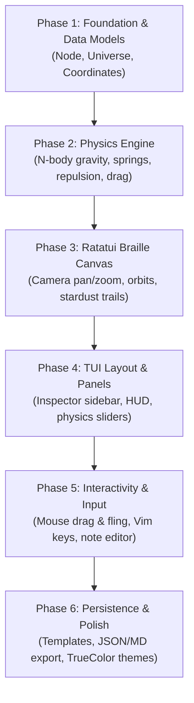

# 🪐 OrbitFlow: System Architecture & Implementation Plan

> **OrbitFlow** is a zero-gravity spatial mindmap and scratchpad built entirely in **Rust** using **Ratatui** and **Crossterm**. Thoughts and notes act as celestial bodies (Stars, Planets, Moons) governed by real-time gravitational and spring physics, rendered directly in the terminal with high-resolution Braille canvas graphics.

---

## 1. Visual & Interactive Concept

```
┌─── OrbitFlow v0.1.0 ──────────────[ Space: PAUSED (Space) ]───[ Zoom: 1.0x ]──[ Mode: NORMAL ]───┐
│ GALAXY VIEWPORT (Braille Canvas)                              │ INSPECTOR / SCRATCHPAD             │
│                                                               │                                    │
│             ·   .    *        .                               │ 🌟 Node: #1 "Project Core"         │
│          .        ╭──────╮      .       ·                     │ Type: Star (Central Hub)           │
│             ·   (  ★ CORE  ) ═════════╗                       │ Mass: 50.0 | Pinned: Yes           │
│        *          ╰──────╯            ║ (Gravitational Spring)│ Tags: #arch #v1                    │
│                     /   \             ║                       │ ────────────────────────────────── │
│                    /     \            ▼                       │ NOTES:                             │
│                   /       \       ╭───────╮                   │ - Core architectural foundation    │
│                  /         \     ( API GW  )                  │ - Handles physics loop & canvas    │
│             ╭────────╮   ╭────────╮╰───────╯                  │ - Next: Wire up crossterm events   │
│            ( Physics  ) ( CanvasUI )                          │                                    │
│             ╰────────╯   ╰────────╯                           │ [e] Edit Note   [c] Connect Node   │
│                  ⠋⠙⠚ (Stardust Trail)                         │ [p] Pin/Unpin   [d] Delete Node    │
│                                                               │                                    │
├───────────────────────────────────────────────────────────────┴────────────────────────────────────┤
│ [Tab] Switch Pane  │ [n] New Node  │ [Space] Pause/Play  │ [f] Focus  │ [+/-] Zoom  │ [?] Help     │
└────────────────────────────────────────────────────────────────────────────────────────────────────┘
```

---

## 2. Core Architectural Components

### A. Physics Engine (`src/physics/`)
1. **N-Body Gravity & Planetary Hierarchy**:
   - **Stars (Hubs)**: High mass, high gravitational pull ($F = G \frac{m_1 m_2}{r^2 + \epsilon^2}$), anchor thoughts.
   - **Planets (Thoughts)**: Medium mass, orbit stars or float in free space.
   - **Moons (Sub-tasks/Action Items)**: Low mass, bound tightly to their parent planet.
2. **Coulomb Electrostatic Repulsion**:
   - Nodes repel when too close ($F_{rep} = \frac{k}{r^2}$), preventing overlapping clutter and self-organizing organic layouts.
3. **Hooke's Law Springs**:
   - Explicit connections between nodes act as damped elastic springs ($F_{spring} = -k (x - x_0)$).
4. **Verlet Integration & Cosmic Drag**:
   - Second-order symplectic numerical integration for jitter-free, energy-conserving orbits.
   - Configurable cosmic drag / velocity damping to let ideas settle gracefully or drift infinitely.

### B. High-Resolution Canvas Rendering (`src/ui/canvas.rs`)
1. **Ratatui Braille Canvas (`ratatui::widgets::canvas::Canvas`)**:
   - 2x4 sub-pixel resolution per terminal cell for silky smooth motion.
   - **Celestial Bodies**: Custom ASCII/Unicode badges (`★ Star`, `● Planet`, `◦ Moon`).
   - **Orbital Paths**: Faint braille ellipses showing orbital trajectory.
   - **Stardust Trails**: History queues of node positions rendered with decaying braille particles (`⠋`, `⠙`, `⠿`, `⢀`).
   - **Force Springs**: Braille lines with tension-based colors (cyan = relaxed, amber = stretched).

### C. Application State & Interaction (`src/app/` & `src/ui/`)
1. **Modal System**:
   - `Normal Mode`: Navigate camera, select nodes, toggle simulation.
   - `Drag Mode`: Mouse drag or keyboard fling to give nodes orbital velocity.
   - `Edit Mode`: Inline modal markdown editor for node notes and tags.
   - `Connect Mode`: Interactive target selection to create springs between nodes.
   - `Command Palette (`:`)`: Search nodes, load templates, save/export.
2. **Camera Viewport**:
   - Smooth 2D pan (`h/j/k/l`, arrows, or mouse drag).
   - Zoom scale (`+`, `-`, or mouse wheel).
   - Auto-tracking camera (`f`) to lock onto an orbiting planet.

### D. Persistence & Presets (`src/storage/`)
1. **JSON Serialization**: Full save/load of universe coordinates, velocities, notes, and links.
2. **Markdown Export**: Export the entire galaxy into a structured hierarchical Markdown document (`# Star > ## Planet > - [ ] Moon`).
3. **Built-in Galaxy Templates**:
   - *Solar System Brainstorm*: Central goal with orbiting themes and task moons.
   - *Chaotic Three-Body Flow*: Fun orbital mechanics sandbox.
   - *Daily Orbit To-Do*: Center is "Today", completed tasks drift away as asteroids.

---

## 3. Technology & Crate Structure

```
orbitflow/
├── Cargo.toml               # ratatui, crossterm, serde, serde_json, rand, chrono
└── src/
    ├── main.rs              # Terminal setup, raw mode, 60 FPS event loop
    ├── app.rs               # State management, active mode, camera viewport
    ├── physics/
    │   ├── mod.rs
    │   ├── engine.rs        # Gravitational N-body, springs, repulsion, Verlet integration
    │   └── particle.rs      # Cosmic background stardust & motion trails
    ├── model/
    │   ├── mod.rs
    │   ├── node.rs          # Node struct (Star/Planet/Moon, mass, vel, notes)
    │   ├── connection.rs    # Spring links and tension
    │   └── universe.rs      # Universe container & query methods
    ├── ui/
    │   ├── mod.rs
    │   ├── theme.rs         # Catppuccin / Cyberpunk TrueColor palettes
    │   ├── canvas.rs        # Braille canvas rendering of space, orbits, nodes
    │   ├── inspector.rs     # Note reader/editor and node metadata sidebar
    │   ├── hud.rs           # Physics controls, status bar, and mode indicator
    │   └── dialogs.rs       # Node creation, help sheet, command palette
    └── storage/
        ├── mod.rs
        └── io.rs            # Save/load JSON & Markdown exporter
```

---

## 4. Step-by-Step Implementation Roadmap



1. **Phase 1: Foundation & Data Models**
   - Implement `Node`, `NodeType`, `Connection`, `Universe`.
   - Setup basic sample data (Sun + orbiting thoughts).
2. **Phase 2: Physics Engine**
   - Write vectorized force calculation (gravity + Coulomb repulsion + Hooke springs).
   - Integrate time steps ($dt$) with symplectic Euler/Verlet.
3. **Phase 3: Ratatui Braille Canvas**
   - Setup raw terminal, alternate screen, and Crossterm event stream.
   - Render nodes, connections, and stardust trails with Braille glyphs.
4. **Phase 4: TUI Layout & Panels**
   - Split view: Canvas (left 70%), Inspector & Scratchpad (right 30%), Bottom HUD.
   - Render selected node's details, markdown notes, and live physics statistics.
5. **Phase 5: Interactivity & Editing**
   - Full keyboard navigation + mouse drag & fling.
   - Add/delete nodes, create connections, edit note modal dialog.
6. **Phase 6: Persistence, Templates & Polish**
   - Built-in templates (*Solar System*, *Daily Orbit*).
   - Save/Load (`~/.orbitflow/` or `./orbit.json`), Export to Markdown.
   - TrueColor theme switcher (Cyberpunk Neon, Catppuccin Mocha, Cosmic Monochrome).

---

## 5. Future Ideas & Backlog

- [ ] Audio feedback / terminal bell on relativistic slingshots and supernova events
- [ ] Gravitational N-body performance tuning with Barnes-Hut quadtree spatial partitioning
- [ ] Export galaxy snapshots to SVG / vector diagram formats
- [ ] Multi-galaxy constellation links and hyperlane connections
